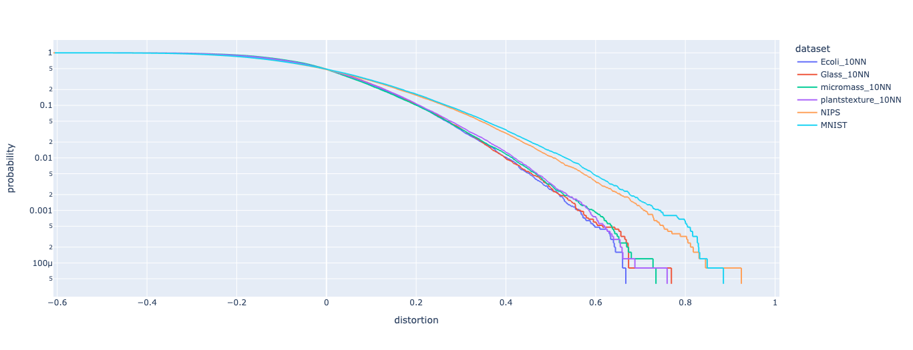

# Optimal Rademacher Projections

## Summary

The repository associated with the paper "Non-Oblivious Performance of Rademacher Random Embeddings".

The results improve accuracy guarantees in a data-dependent (non-oblivious) way using majorization and Schur concavity.

The more spread out the input data, as captured by the majorization order, the more distorted are the embeddings.

## Empirical Comparison

Monte Carlo simulations (N=1000 traces) were performed on random projections (dimension D=50) for several datasets (subsamples of 50 datapoints), that cover the text, image, and graph domains. In this context, sparsity is defined as the number of non-zero entries in a vector. The following table summarizes the analyzed datasets:

| Dataset | Av. Sparsity ($\|x\|_0$) |
|---------|----------|
| Glass_10NN | 13.24 |
| Ecoli_10NN | 13.68 |
| plantstexture_10NN | 13.92 |
| micromass_10NN | 17.24 |
| MNIST | 148.52 |
| NIPS | 676.38 |

For each trace, the distortion was evaluated according to the standard formula $\|A x\|^2 / \|x\|^2-1$, and averaged over the subsampled points.
The following plot shows the distortion distribution tail (empirical CDF) for each dataset. 

It is seen that the better data sparisty (lower $\|x\|_0$), the more accurate (lighter tail) projections.

Sparse random projections are less statistically powerful than Rademacher projections (which have a density parameter of 1). 

This is illustrated by average distortion densities across datasets:

| Mean Distortion | Projection Density |
|------------|---------|
| 0.1 | 0.276501 |
| 0.3 | 0.204172 |
| 0.5 | 0.186883 |
| 1.0 | 0.172732 |

Lower distortion density indicates better performance. As shown, Rademacher projections (density = 1.0) perform best.

## Impleentation

See the [notebook](./notebooks/NonobliviousRademacherProjections.ipynb) for details.
